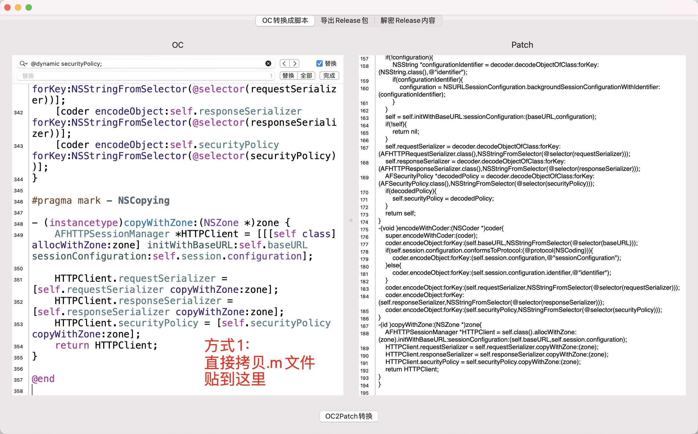
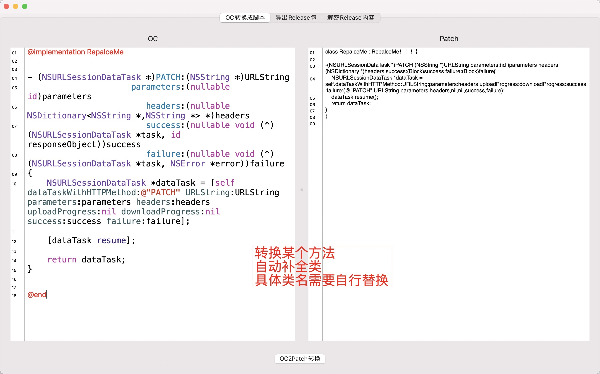
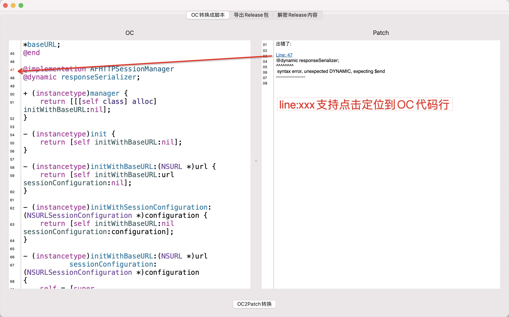
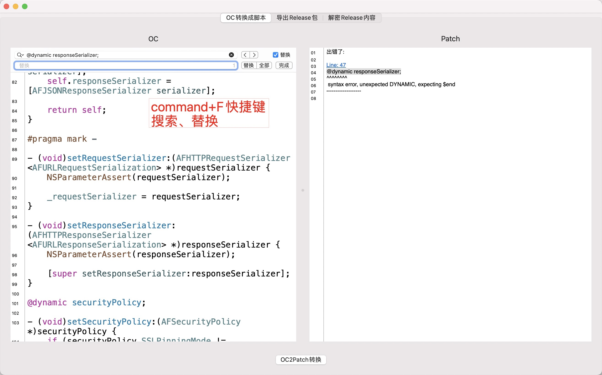
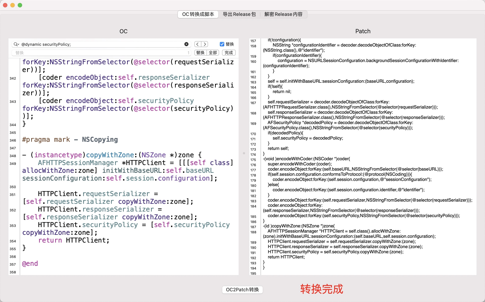
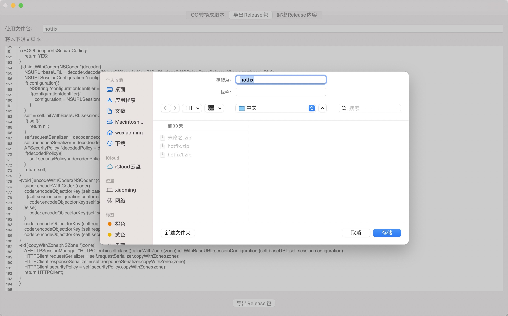
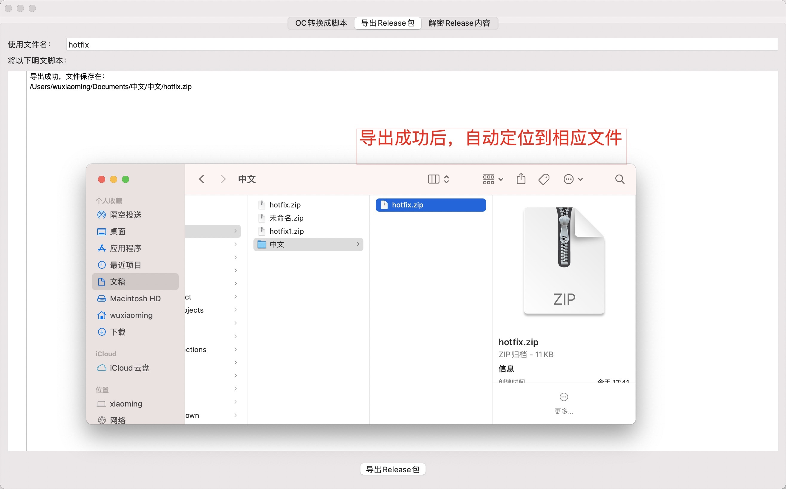
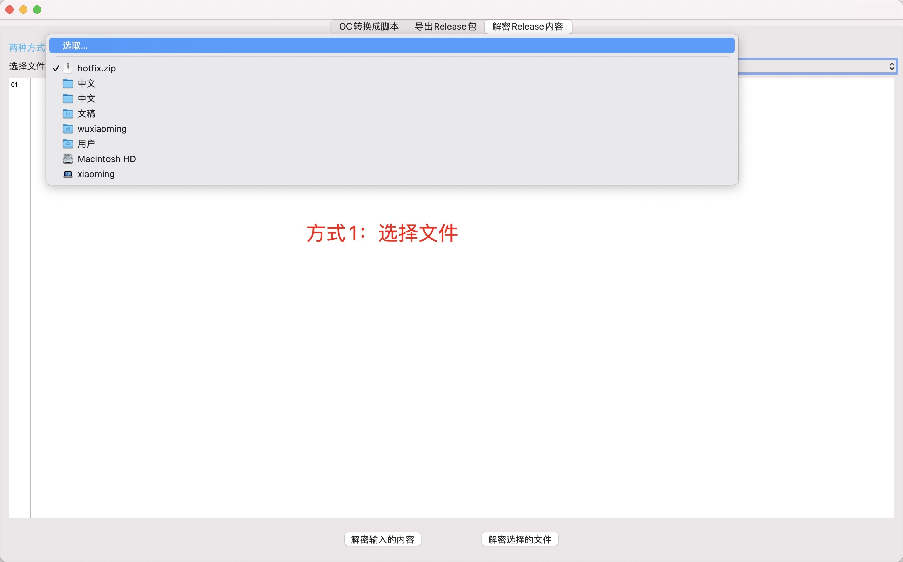
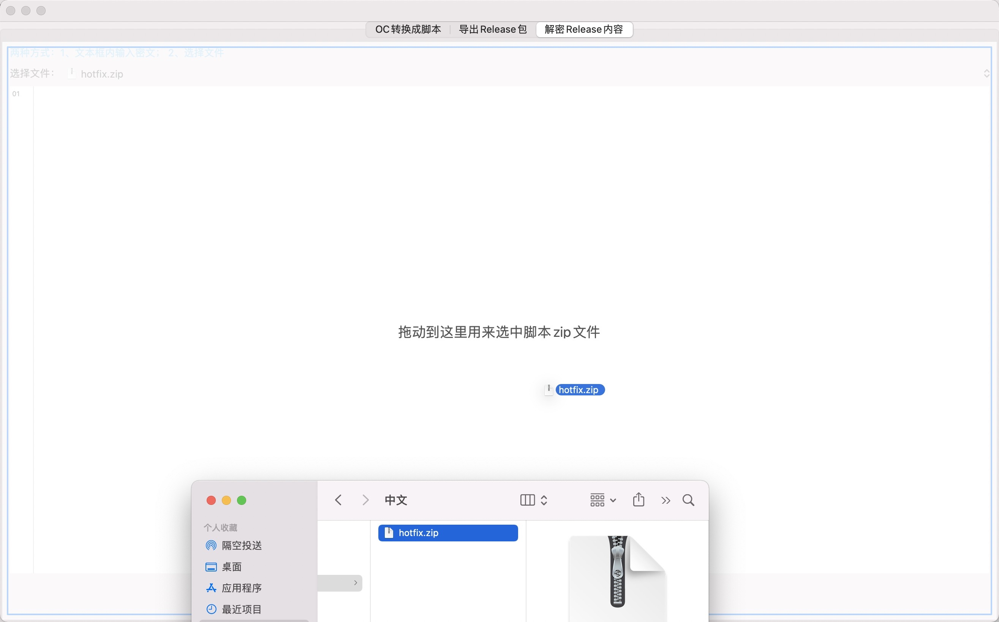
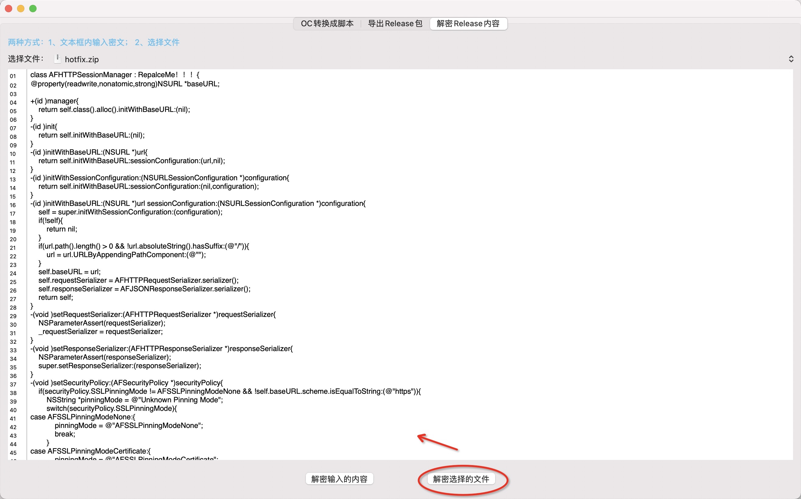

# OC2PatchTool

这是macOS系统上的可视化辅助工具，将OC语言转成mangofix脚本。

做iOS热修复时，大量时间浪费在OC代码翻译成脚本上，提供这个辅助工具，希望能给iOSer提供便利。

我的个人网站：https://action121.github.io/2020/12/03/iOS-hotfix-%E5%B7%A5%E5%85%B7.html


# 支持的功能

1、OC代码 一键 批量转换成脚本

支持复制.m内容粘贴，转换

支持单个OC API转换，自动补全

报错提示:根据行号定位到OC代码行

2、将脚本导出Reease包

导出iOS APP可正常解析的包

3、解密Release包

可用于下载线上已发布的包，查看内容；

发版前check

4、提供帮助菜单

路径：菜单->帮助


# 不支持

预编译相关

编译器内置函数以及属性__attribute__等

a[x], {x,y,z}, a->x

id a = ( identifier )object; 类型转换. 但支持id a = (identifier *)object;

# 热修引擎

[地址](https://github.com/YPLiang19/Mango)

# 感谢

[地址](https://github.com/SilverFruity/oc2mango)

# 本工具源码

我的仓库：
[地址](https://github.com/action121/OC2PatchTool)

# 注意事项

该工具仅限于帮助研发快速完成繁琐的OC 2 脚本的翻译。 

翻译结果仅限于对语法的解析，引擎不支持的能力及逻辑处理需要研发自行测试、调整。 

**！！！严格遵守发版规则，千万不能以工具的转换结果为最终结果！！！**

## Q1、APP可正常运行的操作系统版本号，最低是多少？


```
macOS 10.11
```

## Q2、APP正确的安装姿势？


```
双击MBCommonCryptor.app即可运行。
```

## Q3、打不开“MBCommonCryptor.app”，因为它来自身份不明的开发者

方案1.系统偏好设置>>安全与隐私>>允许安装未知来源


方案2.打开 Terminal 终端后 ，在命令提示后输入


```
sudo spctl --master-disable
```

## Q4、APP是否有更新计划？

敬请期待。

## Q5、版本支持的功能及记录在哪查看？

菜单->帮助->ChangeLog

## Q6、脚本规范与语法在哪里查看？

[地址](https://github.com/YPLiang19/Mango)

## Q7、功能演示

1、 OC 转换成 脚本 支持两种方式


```
方式1.拷贝.m文件内容，粘贴到OC输入框内。 示例代码：AFHTTPSessionManager.m
```




```
方式2. 拷贝某个方法粘贴到OC输入框内，转换时会自动补全
```




2、 OC 转换成 脚本 出错了怎么办？










3、 将脚本打包








4、 查看Release包的内容


方式1. 选择文件




方式2：拖拽








